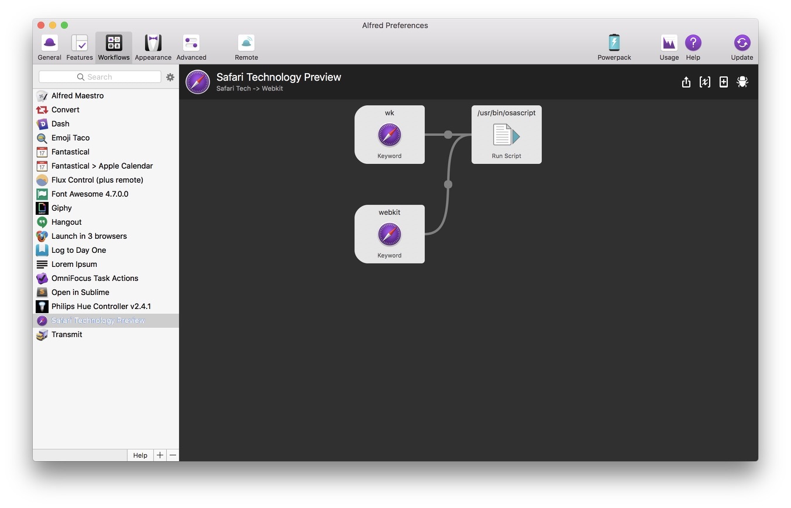

# Safari Technology Preivew -> WebKit

As a web developer, I love to use Safari Technology Preview. However, typing Safari in Alfred always drives me crazy becuase I have to choose which Safari I want to open. 

I developed this simple workflow so that I can now launch Safari Technology Preview by typing `webkit` or `wk` into Alfred. 

You can also pass an optional URL to the command. If you do the URL will be opened inside Safari Technology Preview. If no URL is passed, the application will simply be activated. 

[View on Packal](http://www.packal.org/workflow/safari-tech-preview-webkit)

